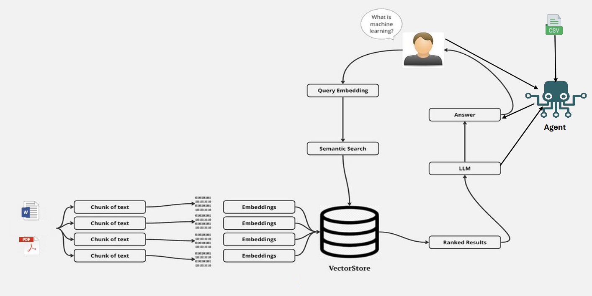

# MultiLLM FileChat

## Introduction

The **MultiLLM-FileChat App** is a powerful tool designed to interactively analyze and retrieve information from various document types (PDF, Word, and CSV) using multiple Large Language Models (LLMs). Built on top of **LangChain** and advanced **embedding techniques**, this app allows users to perform detailed document analysis, question-answering, and content summarization in a user-friendly, chat-like interface.

This app processes and embeds document content, enabling **semantic search** and **conversational AI** to deliver relevant, context-aware responses based on uploaded files. Whether you’re seeking specific details from large PDFs, exploring content in Word documents, or querying structured data in CSV files, the MultiLLM-FileChat App provides a seamless and efficient solution.

## Key Features

- **Document Upload and Processing**: Supports PDF, Word, and CSV file formats, extracting text and data for further analysis.
- **Semantic Search and Embeddings**: Converts document text into embeddings, allowing for efficient similarity searches to locate relevant information quickly.
- **Multi-LLM Compatibility**: Choose from multiple LLMs (e.g., Google Gemini, Llama 3.2) based on your needs for response style and accuracy.
- **CSV Query Agent**: The app includes an intelligent agent specifically designed for interacting with CSV files.
- **Real-Time Question Answering**: Users can ask questions about the document content, and the app retrieves and generates contextually accurate responses.
- **Evaluation Metrics**: Uses RAGAS evaluation metrics (faithfulness, answer relevancy) to assess the accuracy and relevance of responses.

## Technologies Used

The MultiLLM FileChat App was built using the following technologies:

- **LangChain**: Framework for building applications that integrate with LLMs.
- **Streamlit**: For building the user interface and interactive elements.
- **FAISS**: Vector database used to store embeddings and perform efficient semantic search.
- **Google Generative AI**: Supplies embeddings and LLM models (e.g., Google Gemini) for response generation and query processing.
- **Ollama**: An open-source tool that enables users to run large language models (LLMs) locally on their machines (e.g., Llama 3.2).
- **RAGAS**: A library that provides tools to supercharge the evaluation of Large Language Model (LLM) applications by measuring metrics like answer relevancy and faithfulness.

Other dependencies are listed in `requirements.txt`.

## Architecture



The **MultiLLM-FileChat App** consists of two distinct processes to handle different file types: one process for unstructured text files (PDF and Word) and another for structured data files (CSV).

### Process for PDF and Word Files

1. **Document Input**: Users can upload multiple PDF or Word files to the application.

2. **Text Chunking**: The PDFs and Word documents are processed, and the extracted text is broken down into smaller chunks for efficient embedding generation.

3. **Embedding Creation**: Each chunk of text is converted into a semantic embedding using an embedding model (e.g., **OpenAI** or **Google Generative AI**). These embeddings capture the semantic meaning of the text, allowing for similarity-based retrieval.

4. **Vector Storage**: The embeddings are stored in a vector database (e.g., **FAISS**), enabling quick retrieval based on semantic similarity when answering user queries.

5. **User Query Processing**: When a user submits a question, the query is also transformed into a semantic embedding. This query embedding will be used to match relevant chunks in the vector store.

6. **Semantic Search**: The app performs a semantic search in the vector store to identify the most relevant text chunks based on the user query.

7. **Answer Generation**: The most relevant chunks are sent to a **language model** (e.g., Google Gemini or Llama 3.2) to generate a response that accurately answers the user’s question based on the document content.

---

### Process for CSV Files

1. **CSV Input**: Users can upload a CSV file to the application.

2. **Agent Activation**: Upon detecting a CSV file, the app activates a dedicated **agent** that is specifically designed to handle structured data queries. This agent does not rely on chunking or embeddings, as the data is already organized in tabular format.

3. **User Query Processing**: When a user submits a question related to the CSV data, the agent interprets the query and applies relevant operations, such as data filtering, aggregation, or retrieval based on specific data fields.

4. **Answer Generation**: The agent generates a response by directly querying the CSV data based on the user’s question, using the structured information within the file to provide an accurate and relevant answer.

## Dependencies and Installation

To install the MultiLLM FileChat App, please follow these steps:

1. **Clone the repository** to your local machine:
   ```bash
   git clone https://github.com/elmontaser1998/MultiLLM-FileChat.git
   cd MultiLLM-FileChat
   
2. Install the required dependencies by running the following command:
     ```bash
     pip install -r requirements.txt

3. Obtain an API key for Google and OpenA and add it to a `.env` file in the project directory:
    ```
    GOOGLE_API_KEY=your_google_api_key
    OPENAI_API_KEY=your_openai_api_key
    ```
## Usage

To use the MultiLLM FileChat App, follow these steps:

1. Ensure that you have installed the required dependencies and added the OpenAI API key to the `.env` file.

2. Run the `app.py` file using the Streamlit CLI. Execute the following command:
   ```bash
    streamlit run app.py
3. Launch the application: The application will automatically open in your default web browser, displaying the user interface.
4. Select the LLM model from the sidebar (e.g., Google Gemini or Llama 3.2).
5. Upload the document(s) you want to query (PDF, Word, or CSV).
6. Ask questions in natural language: Use the chat interface to ask questions about the loaded document. The app will process your question and return the response along with evaluation metrics for relevancy and faithfulness.

## Contributing
If you would like to contribute, please fork the repository and submit a pull request. Issues and feature requests are welcome!
   
